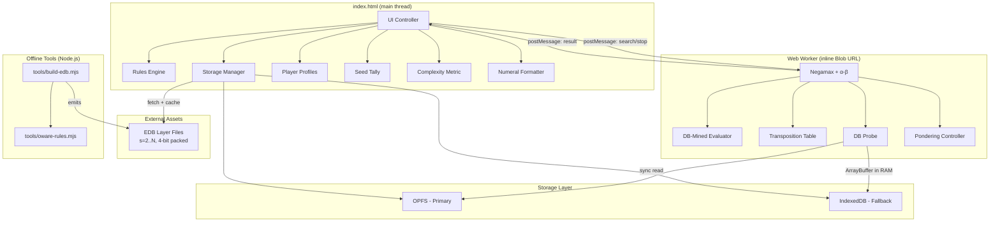
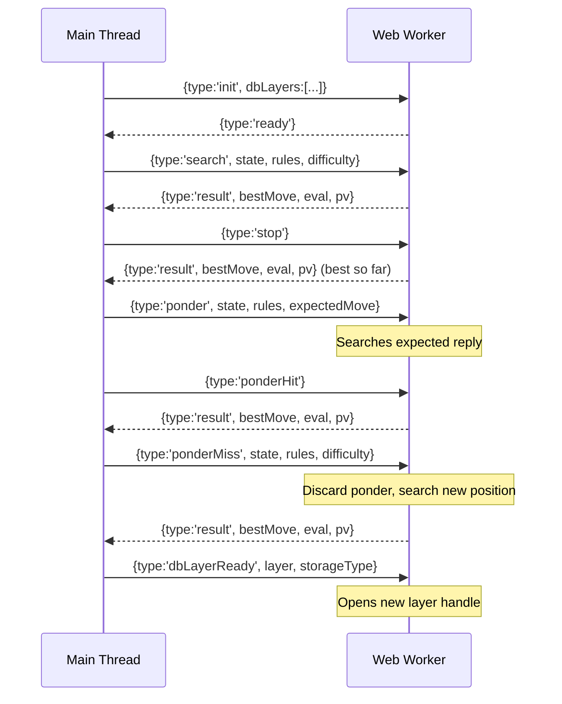
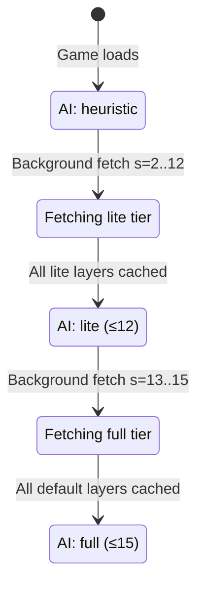

# Design Document: Engine v1 Full Build

## Overview

This design specifies the full v1 engine reform for oware-web — transforming the existing single-file browser game into a complete Oware engine with perfect endgame play, off-thread AI, database-mined evaluation, configurable rules, and social features.

The architecture follows the proven "Lithidion Stack" pattern: opening heuristics → α-β search with DB-mined evaluation → endgame database lookup. All game code remains in a single `index.html`; the Web Worker is instantiated via inline Blob URL; the endgame database is an external binary asset progressively cached in OPFS/IndexedDB.

### Key Design Principles

1. **Single-file constraint** — all runtime code lives in `index.html`; no npm, no bundler, no external JS
2. **Progressive enhancement** — game is fully playable heuristic-only; AI strength grows as DB layers arrive
3. **Rules as parameters** — every rule axis is a tuple `(capture, grandslam, terminal, endMode, cycleLimit)` threaded through engine, search, and builder
4. **Store-independent encoding** — the DB indexes only on-board seed distributions, not banked scores
5. **Off-thread search** — all AI computation in a Web Worker; main thread never blocks

## Architecture

### System Diagram



### Worker Communication Protocol



### Progressive Loading Flow



## Components and Interfaces

### 1. Rules Engine (main thread)

The existing engine functions are refactored to accept a full rules tuple and implement both terminal conventions.

```javascript
// Rules tuple — threaded everywhere
const RulesTuple = {
  capture: '23' | '34',
  grandslam: 'nocap' | 'forbid' | 'oppkeeps' | 'leavelast',
  terminal: 'academic' | 'ownrow',
  repetition: 'split' | 'ownrow' | 'lastmover',
  endMode: 'firstto' | 'allcap',
  target: 25,
  cycleLimit: 100 | 50 | 20 | 200 | 0
};

// State gains a hashHistory for repetition detection
const GameState = {
  h: number[12],        // houses
  score: number[2],     // banked seeds
  turn: 0 | 1,
  ncp: number,          // no-capture ply counter
  hashHistory: Set<string>  // position hashes seen this game
};

// Core functions (unchanged signatures, new terminal logic)
function newState(): GameState
function clone(s: GameState): GameState
function simulate(s, house, rules): {out, res} | null
function legalMoves(s, rules): number[]
function applyMove(s, house, rules): {state, info}
function isOver(s, rules): {over, outcome, score}
function collectSides(s, rules): void  // now convention-aware

// New: position hashing
function positionHash(s: GameState): string
function checkRepetition(s: GameState): boolean
```

**Terminal convention logic in `isOver`:**
- Academic: no legal move → opponent gets all remaining; repetition → split equally
- Own-row: no legal move → each player collects own side; repetition → each collects own side

### 2. Web Worker AI Module

The Worker is a self-contained string embedded in `index.html`, instantiated via Blob URL.

```javascript
// Worker entry point (inside the Blob string)
const WORKER_CODE = `
  // --- Rules engine (duplicated subset) ---
  // simulate, applyMove, legalMoves, isOver, etc.

  // --- Transposition Table ---
  const TT_SIZE = 1 << 20;  // 1M entries
  const tt = new Array(TT_SIZE);

  // --- DB Probe ---
  let layerHandles = {};  // s → FileSystemSyncAccessHandle | ArrayBuffer

  function dbProbe(state, rules) { ... }

  // --- Evaluation ---
  function evalDecisionTree(state, rules, me) { ... }

  // --- Search ---
  function negamax(state, rules, depth, alpha, beta, ply) { ... }
  function rootSearch(state, rules, config) { ... }

  // --- Message handler ---
  self.onmessage = function(e) { ... }
`;

// Main-thread instantiation
const workerBlob = new Blob([WORKER_CODE], {type: 'application/javascript'});
const workerUrl = URL.createObjectURL(workerBlob);
const aiWorker = new Worker(workerUrl);
```

**Search configuration (maps from difficulty presets):**

```javascript
const SearchConfig = {
  depth: 4 | 6 | 8 | 10 | 12,
  blunderRate: 0..100,  // % — maps to near-best margin
  useDB: boolean,
  // Derived internally:
  margin: number  // computed from blunderRate: 0% → margin 0, 100% → Infinity
};

// Preset mappings
const PRESETS = {
  easy:   { depth: 4,  blunderRate: 60, useDB: false },
  medium: { depth: 6,  blunderRate: 20, useDB: true },
  hard:   { depth: 8,  blunderRate: 0,  useDB: true },
  custom: null  // user sets each parameter
};
```

### 3. Transposition Table

```javascript
// Entry structure
const TTEntry = {
  hash: string,      // full position hash (verification key)
  value: number,     // stored evaluation
  depth: number,     // search depth when stored
  bound: 'exact' | 'lower' | 'upper',
  bestMove: number   // pit index of best move found
};

// Hash function: board-state only (store-independent)
function computeHash(h: number[12], turn: 0|1): string {
  // Encode h[0..11] + turn into a unique string key
  // Simple: h.join(',') + '|' + turn (fast for JS Map lookup)
  // Or: pack into a 64-bit-like numeric key for array indexing
}

// TT operations
function ttStore(hash, value, depth, bound, bestMove): void
function ttProbe(hash): TTEntry | null
function ttClear(): void
```

**Enhanced Transposition Cut-off:** When a TT entry is found with `entry.depth >= currentDepth`:
- If `bound === 'exact'`: return `entry.value`
- If `bound === 'lower'` and `entry.value >= beta`: return `entry.value` (fail-high)
- If `bound === 'upper'` and `entry.value <= alpha`: return `entry.value` (fail-low)

**Safe Futility Pruning:** Because the total seeds in play are known, a hard upper bound on any position's value is computable: `maxPossible = score[me] + boardSeeds(state)`. If `maxPossible <= alpha`, prune.

### 4. DB Probe

```javascript
// Combinatorial Number System: rank/unrank for stars-and-bars
// Maps h[0..11] with Σh = s to index in 0..C(s+11, 11)-1

function rank(h: number[12], s: number): number {
  // Stars-and-bars ranking using combinatorial number system
  let idx = 0;
  let remaining = s;
  for (let i = 11; i >= 1; i--) {
    for (let v = 0; v < h[i]; v++) {
      idx += comb(remaining - v + i - 1, i);  // C(remaining-v+i-1, i)
    }
    remaining -= h[i];
  }
  return idx;
}

function unrank(idx: number, s: number): number[12] {
  // Inverse: reconstruct h[0..11] from idx and layer s
  const h = new Array(12).fill(0);
  let remaining = s;
  for (let i = 11; i >= 1; i--) {
    while (idx >= comb(remaining + i - 1, i)) {  // actually: while can subtract
      // Find h[i] by successive subtraction of C values
    }
    remaining -= h[i];
  }
  h[0] = remaining;
  return h;
}

// Canonicalisation: rotate North-to-move → South-to-move
function canonicalise(h: number[12], turn: 0|1): {h: number[12], rotated: boolean} {
  if (turn === 0) return { h, rotated: false };
  // 180° rotation: swap h[0..5] with h[6..11]
  const rotated = [...h.slice(6), ...h.slice(0, 6)];
  return { h: rotated, rotated: true };
}

// Full probe: state → value (seeds mover captures from remaining)
function dbProbe(state: GameState, rules: RulesTuple): number | null {
  const s = boardSeeds(state);
  if (!layerHandles[s]) return null;  // layer not loaded

  const { h: canon } = canonicalise(state.h, state.turn);
  const idx = rank(canon, s);
  const byteOffset = Math.floor(idx / 2);
  const nibbleHigh = (idx % 2 === 0);

  // Read byte from storage
  const byte = readByte(layerHandles[s], byteOffset);
  return nibbleHigh ? (byte >> 4) : (byte & 0x0F);
}

// Convert DB value to search score
function dbValueToScore(dbVal, state, me): number {
  const s = boardSeeds(state);
  const moverCaptures = dbVal;
  const oppCaptures = s - dbVal;
  const finalMe = state.score[me] + (state.turn === me ? moverCaptures : oppCaptures);
  const finalOpp = state.score[me^1] + (state.turn === me ? oppCaptures : moverCaptures);
  // Return large positive/negative for win/loss, 0 for draw, or scaled diff
  const diff = finalMe - finalOpp;
  if (diff > 0) return 90000 + diff;
  if (diff < 0) return -90000 + diff;
  return 0;
}
```

### 5. Evaluation Function (DB-Mined Decision Tree)

```javascript
// Features extracted from position
function extractFeatures(state, me) {
  const opp = me ^ 1;
  return {
    material: state.score[me] - state.score[opp],
    oppEmptyPits: countEmpty(state, opp),   // empty pits on opponent's side
    ownEmptyPits: countEmpty(state, me),     // empty pits on own side
    reach: countReach(state, me),            // pits with ≥(distance to opp) seeds
    krooCount: countKroo(state, me),         // pits with >12 seeds
  };
}

// Decision tree (fitted offline from N=15 DB analysis)
// Structure: binary tree, internal nodes split on a feature threshold,
// leaves hold (mu, sigma) pairs
const EVAL_TREE = {
  feature: 'oppEmptyPits', threshold: 3,
  left: { feature: 'material', threshold: -2,
    left: { mu: -3.2, sigma: 4.1 },   // losing, high variance
    right: { mu: 0.8, sigma: 2.9 }    // neutral
  },
  right: { feature: 'reach', threshold: 2,
    left: { mu: 1.5, sigma: 3.4 },
    right: { mu: 4.1, sigma: 2.2 }    // dominant position
  }
};
// Note: actual tree fitted from DB analysis; above is illustrative structure

function evalDecisionTree(state, rules, me) {
  const f = extractFeatures(state, me);
  let node = EVAL_TREE;
  while (node.feature) {
    node = f[node.feature] < node.threshold ? node.left : node.right;
  }
  return Math.round(((node.mu + f.material) / node.sigma) * 100);
}
```

### 6. Storage Manager

```javascript
// Manages progressive download, caching, and access to EDB layers

const StorageManager = {
  storageType: 'opfs' | 'indexeddb' | 'none',

  async init() {
    // Detect OPFS availability
    if (navigator.storage && navigator.storage.getDirectory) {
      this.storageType = 'opfs';
    } else if (window.indexedDB) {
      this.storageType = 'indexeddb';
    }
  },

  async hasLayer(s: number): boolean { ... },
  async storeLayer(s: number, data: ArrayBuffer): void { ... },
  async getLayerHandle(s: number): FileSystemSyncAccessHandle | ArrayBuffer { ... },

  async progressiveLoad(onLayerReady: (s) => void) {
    // Phase 1: fetch s=2..12 (lite tier)
    for (let s = 2; s <= 12; s++) {
      if (await this.hasLayer(s)) { onLayerReady(s); continue; }
      const data = await fetch(`edb/layer-${s}.bin`).then(r => r.arrayBuffer());
      await this.storeLayer(s, data);
      onLayerReady(s);
    }
    // Phase 2: fetch s=13..15 (full tier)
    for (let s = 13; s <= 15; s++) { ... }
  }
};
```

### 7. Numeral Formatter

```javascript
const NUMERAL_MODES = ['arabic', 'binary', 'hex', 'tally', 'roman'];

function formatNumeral(n: number, mode: string): string {
  switch (mode) {
    case 'arabic': return String(n);
    case 'binary': return n.toString(2).padStart(6, '0');
    case 'hex':    return n.toString(16).toUpperCase();
    case 'tally':  return tallyFormat(n);  // groups of 5 as 𝍸, remainder as ·
    case 'roman':  return toRoman(n);      // standard I, V, X, L conversion
    default:       return String(n);
  }
}

function tallyFormat(n: number): string {
  const fives = Math.floor(n / 5);
  const ones = n % 5;
  return '𝍸'.repeat(fives) + '·'.repeat(ones);
}
```

### 8. Player Profiles & Seed Tally

```javascript
// Profile storage
const PROFILES_KEY = 'zako-oware-profiles';
const TALLY_KEY = 'zako-oware-tally';

// Profile: just a username string stored in a list
function getProfiles(): string[] { ... }
function addProfile(name: string): void { ... }
function removeProfile(name: string): void { ... }

// Tally: per-pairing cumulative seeds
// Key format: "alice|bob" (sorted alphabetically) or "player|cpu-medium"
function getPairingKey(p1: string, p2: string): string {
  return [p1, p2].sort().join('|');
}

function getTally(key: string): {a: number, b: number} { ... }
function addToTally(key: string, scoreA: number, scoreB: number): void { ... }
function resetTally(key: string): void { ... }
```

### 9. Complexity Metric

```javascript
// C(boardSeeds + 11, 11) = number of positions at this layer
function layerSize(s: number): number {
  return comb(s + 11, 11);
}

// Normalise against full state-space benchmark (~8.9 × 10^11)
const FULL_STATE_SPACE = 889_000_000_000;

function complexityRating(state: GameState): {
  raw: number,         // C(s+11, 11)
  normalized: number,  // 0–100 scale
  solved: boolean      // whether DB covers this layer
} {
  const s = boardSeeds(state);
  const raw = layerSize(s);
  // Normalise: log-scale mapping to 0-100
  const normalized = Math.round(
    (Math.log(raw) / Math.log(FULL_STATE_SPACE)) * 100
  );
  const solved = s <= loadedMaxLayer;
  return { raw, normalized, solved };
}
```

### 10. Rules Module (tools/oware-rules.mjs)

```javascript
// ES module exporting the engine's core logic for Node.js use by the Builder

export const HOUSES = 12, SIDE = 6;

export function newState() { ... }
export function clone(s) { ... }
export function belongs(i, p) { ... }
export function sideSeeds(s, p) { ... }
export function boardSeeds(s) { ... }
export function capturable(c, rule) { ... }
export function simulate(s, house, rules) { ... }
export function applyMove(s, house, rules) { ... }
export function legalMoves(s, rules) { ... }
export function isOver(s, rules) { ... }
export function collectSides(s, rules) { ... }

// Rules parameter: {capture, grandslam, terminal}
// Terminal logic: 'academic' | 'ownrow'
// Both conventions implemented, selectable via rules.terminal
```

### 11. EDB Builder (tools/build-edb.mjs)

```javascript
// Offline Node.js script — imports oware-rules.mjs

import { simulate, applyMove, legalMoves, isOver, ... } from './oware-rules.mjs';

// Combinatorial number system
export function comb(n, k) { ... }       // binomial coefficient
export function rank(h, s) { ... }       // distribution → index
export function unrank(idx, s) { ... }   // index → distribution

// Canonicalisation
export function canonicalise(h, turn) { ... }

// Build one layer
function buildLayer(s, rules, solvedLayers) {
  const size = comb(s + 11, 11);
  const values = new Uint8Array(size).fill(0xFF);  // 0xFF = unresolved

  // Phase 1: Capture pre-pass — seed from solved smaller layers
  for (let idx = 0; idx < size; idx++) {
    const h = unrank(idx, s);
    const state = { h, score: [0,0], turn: 0, ncp: 0 };
    const moves = legalMoves(state, rules);
    for (const mv of moves) {
      const { state: child } = applyMove(state, mv, rules);
      const childS = boardSeeds(child);
      if (childS < s && solvedLayers[childS]) {
        // Child is in a solved layer — compute value
        const childVal = probeSolvedLayer(child, childS, solvedLayers);
        const moverVal = s - childVal;  // seeds mover captures
        values[idx] = Math.max(values[idx] === 0xFF ? 0 : values[idx], moverVal);
      }
    }
  }

  // Phase 2: Terminal value initialisation
  for (let idx = 0; idx < size; idx++) {
    const h = unrank(idx, s);
    const state = { h, score: [0,0], turn: 0, ncp: 0 };
    if (legalMoves(state, rules).length === 0) {
      // Terminal: apply convention
      values[idx] = terminalValue(h, s, rules);
    }
  }

  // Phase 3: Fixed-point iteration
  let changed = true;
  while (changed) {
    changed = false;
    for (let idx = 0; idx < size; idx++) {
      if (values[idx] !== 0xFF && /* already final */) continue;
      const h = unrank(idx, s);
      const state = { h, score: [0,0], turn: 0, ncp: 0 };
      const newVal = computeValue(state, s, rules, values, solvedLayers);
      if (newVal !== values[idx]) { values[idx] = newVal; changed = true; }
    }
  }

  return values;
}

// Phase 4: Verification sweep
function verifyLayer(s, values, rules, solvedLayers) {
  for (let idx = 0; idx < values.length; idx++) {
    const rederived = computeValueFromSuccessors(idx, s, rules, values, solvedLayers);
    if (rederived !== values[idx]) {
      throw new Error(`Verification failed: layer=${s}, idx=${idx}, stored=${values[idx]}, derived=${rederived}`);
    }
  }
}

// Emit 4-bit packed binary
function emitPackedBinary(values, outputPath) {
  const packed = new Uint8Array(Math.ceil(values.length / 2));
  for (let i = 0; i < values.length; i += 2) {
    const hi = values[i] & 0x0F;
    const lo = (i + 1 < values.length) ? (values[i+1] & 0x0F) : 0;
    packed[i >> 1] = (hi << 4) | lo;
  }
  fs.writeFileSync(outputPath, packed);
}
```

## Data Models

### Game State

```javascript
// Extended state for v1
{
  h: [4,4,4,4,4,4,4,4,4,4,4,4],  // 12 houses
  score: [0, 0],                    // banked seeds [South, North]
  turn: 0,                          // 0 = South, 1 = North
  ncp: 0,                           // no-capture ply counter
  hashHistory: new Set()            // Set<string> of position hashes this game
}
```

### Rules Configuration (localStorage: `zako-oware-rules`)

```json
{
  "capture": "23",
  "grandslam": "nocap",
  "terminal": "academic",
  "repetition": "split",
  "endMode": "firstto",
  "cycleLimit": 100
}
```

### AI Configuration (localStorage: `zako-oware-ai`)

```json
{
  "preset": "hard",
  "depth": 8,
  "blunderRate": 0,
  "useDB": true
}
```

### Player Profiles (localStorage: `zako-oware-profiles`)

```json
{
  "names": ["Alice", "Bob"]
}
```

### Seed Tally (localStorage: `zako-oware-tally`)

```json
{
  "vs-cpu-easy":   { "you": 245, "opp": 198 },
  "vs-cpu-medium": { "you": 342, "opp": 319 },
  "vs-cpu-hard":   { "you": 89,  "opp": 156 },
  "alice|bob":     { "a": 412,   "b": 388 }
}
```

### EDB Layer File Format

```
File: edb/layer-{s}.bin
Encoding: 4-bit packed (2 entries per byte)
  Byte[i] = (value[2i] << 4) | value[2i + 1]
Size: ceil(C(s+11, 11) / 2) bytes per layer
Value range: 0..s (seeds the South-to-move player captures)
Index: rank(canonicalised_h, s)
```

### Strength Indicator State

```javascript
// Computed from loaded layers
{
  tier: 'heuristic' | 'lite' | 'full',
  maxLayer: number,  // highest loaded s
  label: 'AI: heuristic' | 'AI: lite (≤12)' | 'AI: full (≤15)'
}
```

### Worker Message Types

```typescript
// Main → Worker
type SearchMsg = { type: 'search', state: GameState, rules: RulesTuple, difficulty: SearchConfig }
type StopMsg = { type: 'stop' }
type PonderMsg = { type: 'ponder', state: GameState, rules: RulesTuple, expectedMove: number }
type PonderHitMsg = { type: 'ponderHit' }
type PonderMissMsg = { type: 'ponderMiss', state: GameState, rules: RulesTuple, difficulty: SearchConfig }
type DBLayerReadyMsg = { type: 'dbLayerReady', layer: number, storageType: 'opfs' | 'idb' }
type InitMsg = { type: 'init', dbLayers: number[], storageType: 'opfs' | 'idb' }

// Worker → Main
type ResultMsg = { type: 'result', bestMove: number, eval: number, pv: number[] }
type ReadyMsg = { type: 'ready' }
```


## Correctness Properties

*A property is a characteristic or behavior that should hold true across all valid executions of a system — essentially, a formal statement about what the system should do. Properties serve as the bridge between human-readable specifications and machine-verifiable correctness guarantees.*

### Property 1: Academic terminal — opponent receives all seeds on no-move

*For any* board state where the mover has no legal move under academic convention, applying the terminal rule shall award all remaining on-board seeds to the opponent (opponent's score increases by exactly `boardSeeds`).

**Validates: Requirements 1.1**

### Property 2: Academic repetition — seeds split equally

*For any* board state that recurs in the hash history under academic convention, the terminal rule shall split remaining on-board seeds equally between both players (each receives `floor(boardSeeds / 2)` or `ceil(boardSeeds / 2)`).

**Validates: Requirements 1.2**

### Property 3: Own-row terminal — each player collects own side

*For any* board state reaching a terminal condition under own-row convention, each player shall receive exactly the sum of seeds on their own 6 houses.

**Validates: Requirements 1.4**

### Property 4: Hash history grows with each move

*For any* legal move sequence of length `n` from a starting position, the hash history shall contain exactly `n + 1` entries (including the starting position), and each entry shall equal the position hash at that point in the game.

**Validates: Requirements 2.1**

### Property 5: Repetition detection correctness

*For any* board position that has been previously visited in the current game (its hash exists in the hash history), the engine shall declare a repetition when that position is reached again.

**Validates: Requirements 2.2**

### Property 6: ncp counter triggers terminal at cycle limit

*For any* game state where `ncp >= cycleLimit` (and cycleLimit > 0), `isOver` shall return `over: true` with the terminal convention applied to the remaining seeds.

**Validates: Requirements 2.4**

### Property 7: First-to-25 terminates at threshold

*For any* game state in first-to-25 mode where either `score[0] >= 25` or `score[1] >= 25`, `isOver` shall return `over: true`.

**Validates: Requirements 3.2**

### Property 8: All-capture mode continues despite high scores

*For any* game state in all-capture mode where scores exceed 25 but `boardSeeds > 0`, legal moves exist, and no repetition has occurred, `isOver` shall return `over: false`.

**Validates: Requirements 3.3**

### Property 9: Rules Module equivalence

*For any* valid `(state, house, rules)` triple, `simulate(state, house, rules)` from the Rules Module (`tools/oware-rules.mjs`) shall produce identical output to the corresponding logic in `index.html`.

**Validates: Requirements 4.2, 4.4**

### Property 10: Rank/unrank round-trip

*For any* valid board distribution `h[0..11]` with `Σh = s`, `unrank(rank(h, s), s)` shall produce the original distribution `h`.

**Validates: Requirements 5.2, 5.3**

### Property 11: Canonicalisation idempotence and symmetry

*For any* board distribution `h` and turn, (a) canonicalising an already-canonical position returns the same position, and (b) a position `(h, North)` and its 180°-rotated equivalent `(rotate(h), South)` produce the same canonical form and rank.

**Validates: Requirements 5.4**

### Property 12: 4-bit packing round-trip

*For any* array of values in range 0–15, packing into the 4-bit binary format and then unpacking shall produce the original array.

**Validates: Requirements 5.7**

### Property 13: DB probe returns correct value for known positions

*For any* position within a loaded EDB layer, the DB probe (canonicalise → rank → seek → read nibble) shall return the same value as the builder stored for that position's canonical form.

**Validates: Requirements 7.1**

### Property 14: Feature extraction correctness

*For any* board state, `oppEmptyPits` shall equal the count of zero-valued houses on the opponent's side, `ownEmptyPits` shall equal the count on the own side, `reach` shall equal the count of own houses with enough seeds to reach opponent territory, and `krooCount` shall equal the count of own houses with more than 12 seeds.

**Validates: Requirements 10.1**

### Property 15: Evaluation formula correctness

*For any* position classified to a decision-tree leaf with `(μ, σ)`, the evaluation score shall equal `round(((μ + material) / σ) * 100)` where `material = score[me] - score[opp]`.

**Validates: Requirements 10.3**

### Property 16: Move ordering — captures first, descending

*For any* position with both capture and non-capture legal moves, the search's move ordering shall place all capture moves before all non-capture moves, and capture moves shall be sorted by captured-seed count in descending order.

**Validates: Requirements 11.1, 11.2**

### Property 17: Transposition table store/probe round-trip

*For any* TT entry stored with a given hash, probing with that same hash shall return the stored entry (value, depth, bound, bestMove). The hash shall be store-independent: two positions differing only in banked scores shall produce the same hash.

**Validates: Requirements 12.1, 12.2**

### Property 18: Safe futility pruning soundness

*For any* position where `score[me] + boardSeeds(state) <= alpha`, futility pruning is safe (the position cannot possibly exceed alpha regardless of play). The pruning shall not fire when `score[me] + boardSeeds(state) > alpha`.

**Validates: Requirements 12.4**

### Property 19: Seed tally accumulates correctly

*For any* sequence of game endings with scores `(a_i, b_i)`, the cumulative tally after all games shall equal `(Σa_i, Σb_i)`.

**Validates: Requirements 14.1**

### Property 20: Seed tally persists across new games

*For any* non-zero tally state, starting a new game shall not change the tally values.

**Validates: Requirements 14.5**

### Property 21: Tally display format

*For any* tally values `(you: N, opp: M)` and opponent name string, the rendered tally display shall contain both numeric values N and M and the opponent name.

**Validates: Requirements 14.3**

### Property 22: Complexity metric computation

*For any* board state with `s = boardSeeds`, the raw complexity shall equal `C(s + 11, 11)`, and the normalised complexity shall be in the range [0, 100] and shall be monotonically non-decreasing with respect to layer size.

**Validates: Requirements 18.1, 18.2**

### Property 23: Numeral formatting correctness

*For any* seed count `n` in range 0–48: Arabic mode produces `String(n)`, Binary mode produces a 6-character string of 0s and 1s equal to the binary representation, Hexadecimal mode produces `n.toString(16).toUpperCase()`, Tally mode produces `floor(n/5)` tally marks followed by `n%5` dots, and Roman mode produces the standard Roman numeral for `n` (with 0 yielding an empty or "N" representation).

**Validates: Requirements 20.2, 20.3**


## Error Handling

### Storage Errors

| Scenario | Handling |
|----------|----------|
| OPFS unavailable | Fall back to IndexedDB silently; log to console |
| IndexedDB unavailable | Continue with heuristic-only AI; no DB features |
| Layer fetch fails (network) | Retry with exponential backoff (3 attempts); skip layer on permanent failure |
| Layer data corrupted (wrong size) | Discard and re-fetch on next session |
| OPFS quota exceeded | Stop caching new layers; use already-cached layers only |

### Worker Errors

| Scenario | Handling |
|----------|----------|
| Worker fails to instantiate | Fall back to main-thread search (existing `chooseMove`) |
| Worker crashes during search | Main thread detects via `onerror`; restart Worker; retry search |
| Worker search timeout (>10s) | Send stop message; use best move found so far |
| Invalid message format | Log warning; ignore message |

### Rules Engine Errors

| Scenario | Handling |
|----------|----------|
| Invalid move attempted | Return null from `simulate`; UI shows "Not a legal house" |
| Hash history corruption | Reset hash history; log warning; continue with ncp-only cycle detection |
| localStorage unavailable | Game fully playable; settings/records/tally not persisted |
| localStorage quota exceeded | Silently fail writes; existing data preserved |

### Builder Errors (Offline Tool)

| Scenario | Handling |
|----------|----------|
| Verification sweep fails | Abort with diagnostic: layer number, position index, stored vs. derived values |
| Invalid ruleset parameter | Exit with usage message listing valid options |
| Out of memory (large N) | Use streaming/chunked processing; recommend lower N |
| Rank overflow (N > 17) | Use BigInt arithmetic; warn about build time |

### Graceful Degradation Hierarchy

```
Full strength: OPFS + all layers + Worker + decision-tree eval
     ↓ (OPFS unavailable)
IndexedDB mode: layers in RAM + Worker + decision-tree eval
     ↓ (no layers cached)
Heuristic mode: Worker + hand-tuned eval (no DB)
     ↓ (Worker fails)
Legacy mode: main-thread search (existing chooseMove function)
```

## Testing Strategy

### Dual Testing Approach

The engine v1 build requires both property-based tests (for universal correctness) and example-based tests (for specific scenarios and integration points).

### Property-Based Testing

**Library:** [fast-check](https://github.com/dubzzz/fast-check) (JavaScript/TypeScript PBT library)

**Configuration:**
- Minimum 100 iterations per property test
- Each test tagged with: `Feature: engine-v1-full-build, Property {N}: {title}`
- Tests run via: `node --test` (Node.js built-in test runner) or Vitest

**Property tests to implement (from Correctness Properties above):**

1. **Rules engine properties (Properties 1–8):** Generate random valid board states using custom arbitraries for `h[0..11]` distributions; test terminal conventions, repetition detection, end modes
2. **Rules Module equivalence (Property 9):** Generate random `(state, move, rules)` triples; run through both codepaths
3. **Rank/unrank round-trip (Property 10):** Generate random distributions of s seeds into 12 bins (stars-and-bars)
4. **Canonicalisation (Property 11):** Generate random `(h, turn)` pairs; verify idempotence and rotation equivalence
5. **4-bit packing (Property 12):** Generate random arrays of nibble values
6. **DB probe (Property 13):** Build a test layer (s=2 or s=3), probe all positions, verify against builder output
7. **Feature extraction (Property 14):** Generate random board states, verify feature counts by independent naive computation
8. **Eval formula (Property 15):** Generate random positions + tree leaves, verify formula
9. **Move ordering (Property 16):** Generate positions with mixed captures/non-captures
10. **TT round-trip (Property 17):** Generate random entries, store/probe
11. **Futility pruning (Property 18):** Generate (position, alpha) pairs, verify pruning correctness
12. **Tally accumulation (Property 19–21):** Generate game result sequences, verify cumulative totals and display
13. **Complexity metric (Property 22):** Generate board states, verify formula
14. **Numeral formatting (Property 23):** Generate seed counts 0–48, verify all 5 modes

### Unit Tests (Example-Based)

- Default rules on fresh load (Req 1.3)
- Hash history resets on new game (Req 2.3)
- End-mode options both present (Req 3.1)
- Rules Module exports all named functions (Req 4.1)
- Builder verification sweep catches corruption (Req 5.6, 5.10)
- Worker stop message returns partial result (Req 6.5)
- OPFS → IndexedDB fallback (Req 7.5)
- Strength indicator labels at each tier (Req 9.1–9.4)
- Difficulty presets set correct parameter values (Req 17.4, 17.5)
- Tally reset only clears active pairing (Req 14.4)
- Numeral mode persists in localStorage (Req 20.4)

### Integration Tests

- Progressive loading sequence: layers arrive in order s=2..12, then 13..15
- Worker search returns valid move for any position
- Pondering: hit path returns instant result; miss path starts fresh search
- Full game playthrough with heuristic-only (no DB)
- Full game playthrough with DB probe at endgame
- Builder: build s=2..5 layers, verify via brute-force negamax on every position

### Test File Structure

```
tests/
  properties/
    rules-engine.test.mjs      # Properties 1–8
    rules-module.test.mjs      # Property 9
    rank-unrank.test.mjs       # Properties 10–11
    packing.test.mjs           # Property 12
    db-probe.test.mjs          # Property 13
    eval-features.test.mjs     # Properties 14–15
    move-ordering.test.mjs     # Property 16
    transposition.test.mjs     # Properties 17–18
    tally.test.mjs             # Properties 19–21
    complexity.test.mjs        # Property 22
    numerals.test.mjs          # Property 23
  unit/
    defaults.test.mjs
    builder-verify.test.mjs
    worker-protocol.test.mjs
    presets.test.mjs
  integration/
    progressive-loading.test.mjs
    full-game.test.mjs
    builder-small-layers.test.mjs
```

### Custom Generators (fast-check Arbitraries)

```javascript
// Generate a valid board distribution with s seeds in 12 houses
const boardDistribution = (s) => fc.array(fc.nat(s), {minLength: 12, maxLength: 12})
  .filter(arr => arr.reduce((a, b) => a + b, 0) === s);

// More efficient: generate via multinomial sampling
const boardState = (maxSeeds = 48) => fc.nat(maxSeeds).chain(s =>
  fc.tuple(...Array(11).fill(fc.nat(s))).map(prefix => {
    // Normalize to sum exactly s
    // ... stars-and-bars generation
  })
);

// Generate a valid game state
const gameState = fc.record({
  h: boardDistribution(fc.nat(48)),
  score: fc.tuple(fc.nat(48), fc.nat(48)),
  turn: fc.constantFrom(0, 1),
  ncp: fc.nat(200)
}).filter(s => s.score[0] + s.score[1] + s.h.reduce((a,b) => a+b, 0) === 48);

// Generate rules tuple
const rulesTuple = fc.record({
  capture: fc.constantFrom('23', '34'),
  grandslam: fc.constantFrom('nocap', 'forbid', 'oppkeeps', 'leavelast'),
  terminal: fc.constantFrom('academic', 'ownrow'),
  repetition: fc.constantFrom('split', 'ownrow', 'lastmover'),
  endMode: fc.constantFrom('firstto', 'allcap'),
  cycleLimit: fc.constantFrom(20, 50, 100, 200, 0)
});
```

